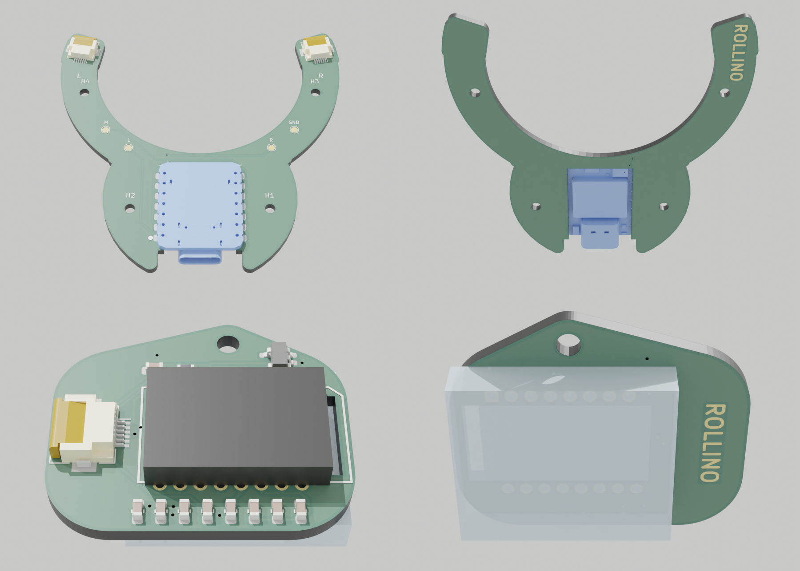
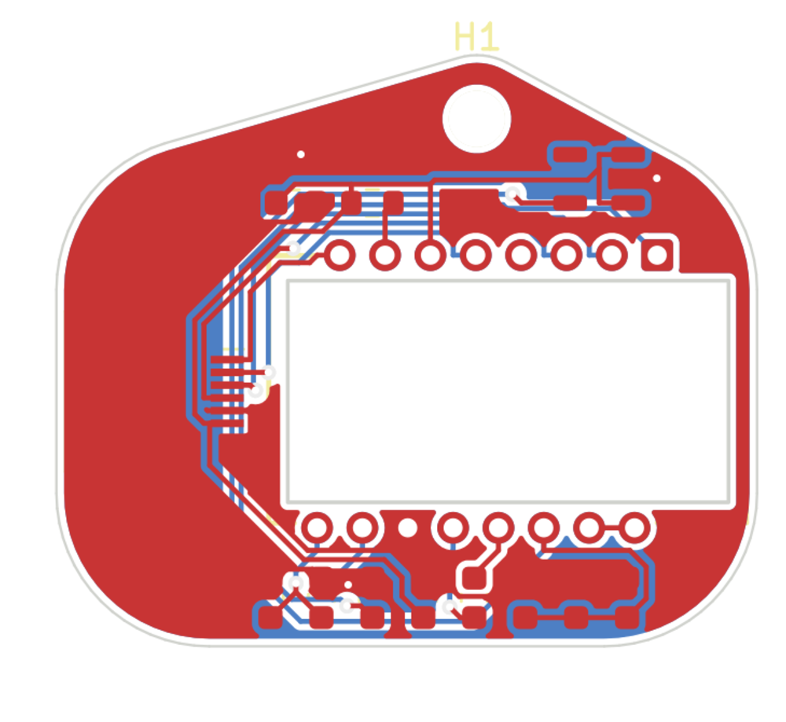
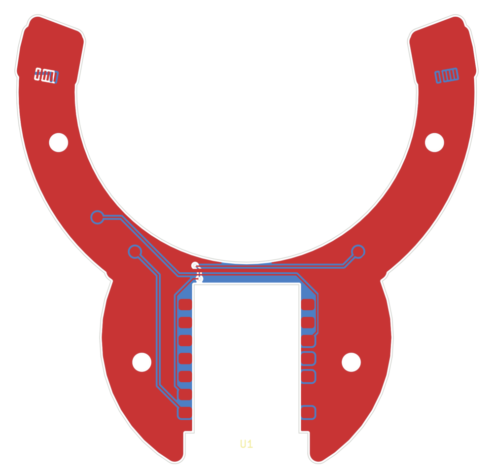

Rollino PCBs
============

Two KiCad 8 projects, generated from the case model: board outlines, and
where the XIAO, the FPC connectors and the screw holes go, all come from
`case/rollino.scad`.



Rebuild them after changing the case (KiCad's own Python; Freerouting 1.5,
Java, Blender 3.x and ImageMagick for routing and rendering):

```
PY=/Applications/KiCad/KiCad.app/Contents/Frameworks/Python.framework/Versions/Current/bin/python3
$PY pcb/gen/generate.py     # schematics, footprints placed on their nets
$PY pcb/gen/route.py        # Freerouting routes every net, GND poured on both layers
pcb/gen/render_pcbs.sh      # the renders above, the layout images and schematic PDFs
```

They overwrite the projects, so make changes in the scripts rather than the
KiCad files, or stop using them once you start editing the boards by hand.

Both boards are routed (0.2 mm tracks, 0.15 mm clearance, 0.3 mm from the
edges, 0.6/0.3 mm vias) and pass DRC with nothing to report, warnings
included (`kicad-cli pcb drc --schematic-parity --severity-all`); the
schematics pass ERC. The sensor board's references are on its fab layer
only, as are the base board's test points' (their labels name them): the
silkscreen has no room for them.

Sensor board (`sensor/`, two needed)
--------------------------------------



[Schematic (PDF)](sensor/rollino-sensor-schematic.pdf)

The same board for both sensors. It's screwed into its pod from the ball
side, chip side out, lens towards the ball; the case's pocket matches its
outline, ear included.

- PMW3610DM-SUDU + LM18-LSI lens: circuit and footprint (with the lens cutout)
  after [badjeff/pmw3610-pcb](https://github.com/badjeff/pmw3610-pcb)
  (CERN-OHL-P-2.0)
- TPS7A0518 1.8 V LDO for the sensor's core: 1 uA quiescent, instead of the
  ~34 uA of the TLV74318 used there, which would otherwise draw more than the
  resting sensor
- FH12-6S-0.5SH FPC connector at the board's up-slope end, mouth facing off
  the edge, so the ribbon is easy to push in and latch before the board goes
  into its pod; the ribbon then bends back over the connector and runs over
  the chip's back to the base board (the pod has room for the bend)
- the ribbon's way down through the pod is roomy (5.5 mm wide, the case
  checks it with a 1.5 mm thick stand-in: `part="fpc_check"` must be empty),
  so its free end can be fed through from the pod or from underneath before
  the boards go in
- the regulator's EN is tied to its VIN by a fixed track between its rows of
  pins (route.py keeps it): the board edge leaves no other way in
- a small ROLLINO logo in bare copper on the back, between the edge and the
  lens
- board frame: origin on the optical axis, x down the slope (towards the
  table), y sideways; nothing goes behind the ear (y beyond -7.9 mm, x
  -6.9..-0.9), where the case has the screw boss

Base board (`base/`)
--------------------



[Schematic (PDF)](base/rollino-base-schematic.pdf)

Lies in a groove in the case's underside, held (with the cover under it) by
four M2 screws.

- Seeed XIAO nRF52840 soldered **upside down** by its castellated edges: its
  parts (USB-C included) hang through the cutout into a pocket in the cover;
  its battery pads face up, and the LiPo's leads solder straight onto them
- J1 (right sensor) and J2 (left) at the band's ends, along it, mouths facing
  the ribbons coming along the channel in the case's underside
- TP1-TP3: optional buttons (left, middle, right click) to TP4 (GND)
- the ROLLINO logo is bare copper (no solder mask) on the back of the band
- pins as in the firmware (`zmk/boards/shields/rollino/rollino.overlay`)

Ribbons
-------

Two 6-way 0.5 mm FFCs, 50 mm long (the stock length: 40 mm ones are hard
to find), with opposite-side (type B) contacts. Each comes down from its
sensor pod under the band's old end, turns in, and with one crease (about
45 degrees, folded flat) lies along a channel in the case's underside,
straight into the base board's connector at the end of the band; the case
model sets where that is from the cable's length (`fpc_len`). The crease
turns the ribbon over, hence type B. The pins at each end are numbered from
the ribbon's path so that each signal meets itself: put the ribbon in, fold
it at the crease and lay it in its channel before the base board goes up.

Parts
-----

| Board | Ref | Part |
|-------|-----|------|
| sensor (x2) | U1 | PMW3610DM-SUDU + LM18-LSI lens |
| | U2 | TPS7A0518PDBVR (SOT-23-5) |
| | J1 | Hirose FH12-6S-0.5SH (or JUSHUO AFC01-S06FCA) |
| | R1 | 10k 0603 |
| | C1 | 3.3 uF 0603 |
| | C2, C3 | 100 nF 0603 |
| | C4 | 100 nF X7R 0603 |
| | C5 | 10 nF 0603 |
| | C6 | 10 uF X7R 0603 |
| | C7 | 10 nF X7R 0603 |
| | C8, C9 | 1 uF 0603 |
| base | U1 | Seeed XIAO nRF52840 (not Sense) |
| | J1, J2 | Hirose FH12-6S-0.5SH (or JUSHUO AFC01-S06FCA) |

`lib/` has the project's own symbols, footprints and 3D models (the XIAO's
from Seeed's, the PMW3610 and its lens as plain blocks); everything else is
from KiCad's standard libraries.
