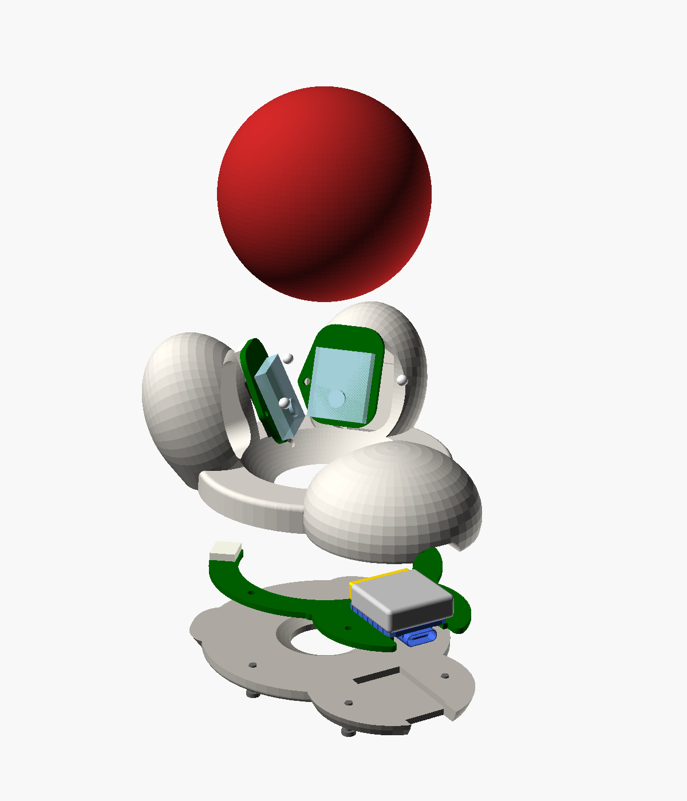

Rollino
=======

An attempt to make a cheap, solid and low profile DIY finger trackball.

The ball floats just 1 mm above the table on three ceramic support balls.
Two PMW3610 sensors look up at the ball from below its equator, placed so
their lines of sight are orthogonal (X, Y and twist are all observable).
A Seeed XIAO nRF52840 running ZMK and a 602020 LiPo lie flat in a squashed
dome in front of the ball. The XIAO is soldered upside down onto a base PCB
that sits in a groove in the underside and reaches round under both sensors,
each wired up with a short FPC ribbon; a cover over the whole underside hides
it, held by the same screws.

- `case/rollino.scad` - parametric OpenSCAD model (ball size, sensor/MCU
  placement, battery, ...). Set `part` to `assembly`, `exploded`, `hardware`, `section`,
  or `body` / `base_cover` for printable parts.
- `case/renders/` - preview renders.
- `pcb/` - KiCad projects for the sensor boards and the base board, with
  schematics, generated from the case model (see [pcb/readme.md](pcb/readme.md)).
- `datasheets/` - component datasheets. The PMW3610 datasheet is available
  [here](https://www.epsglobal.com/Media-Library/EPSGlobal/Products/files/pixart/PMW3610DM-SUDU.pdf?ext=.pdf).

Firmware
--------

ZMK, built by GitHub Actions on every push (download `firmware.zip` from the
run, then double-tap the XIAO's reset and copy the `.uf2` onto it). It's a
standalone Bluetooth/USB mouse.

- `zmk/boards/shields/rollino/` - the shield: pins, the two PMW3610 sensors
  (Zephyr's driver), three optional buttons.
- `zmk/src/ball_fusion.c` - combines the two sensors: each one only sees the
  ball's surface sliding past in its own tilted plane; together they give the
  ball's whole rotation. Rolling moves the pointer (as if the finger on top
  dragged it), twisting about the vertical axis scrolls.
- `config/rollino.keymap` - the buttons: left, right, middle click.

| XIAO pin | Use |
|----------|-----|
| D8 | SCLK, both sensors |
| D10 | SDIO, both sensors (SPI MOSI and MISO on the same pin) |
| D7 | NCS, right sensor |
| D6 | NCS, left sensor |
| D3 | MOTION, right sensor |
| D2 | MOTION, left sensor |
| D0, D1, D9 | optional buttons to GND: left, right, middle click |
| D4, D5 | free |

**Calibrating the sensors' orientation.** The fusion needs to know which way
each sensor's X axis points (`rotation` in the shield's `ball_fusion` node,
plus the sensor's `invert-x` / `invert-y`), which depends on how the chip
sits on the sensor PCB. Roll the ball right: the pointer should go right;
towards you: down; twist it: scroll, with no drift. If one direction is off,
try one sensor at a time (cover the other's lens) and fix its rotation /
inversion until rolling right moves the pointer mostly right.
